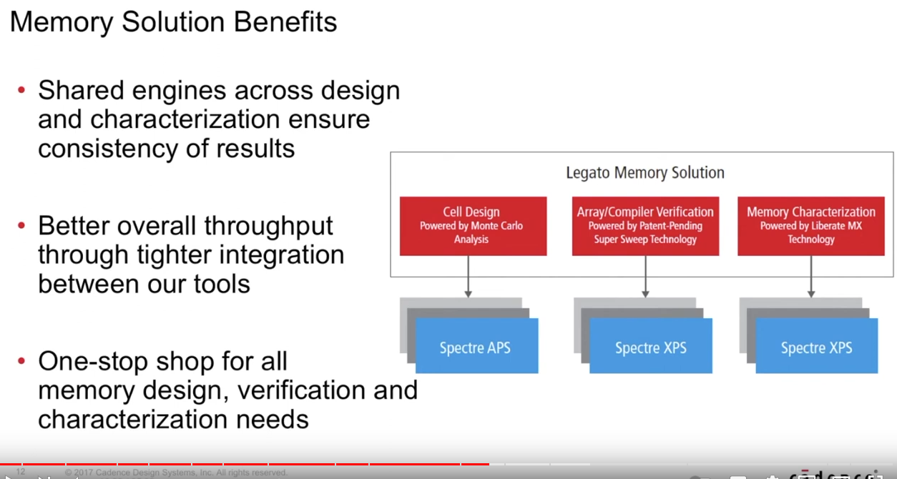

# SRAM 

## SPECIFICATION 

|       TYPE       |     VALUE     |
| ---------------- | ------------- |
|     Word Size    |    32 Bits    |
| Number of Words  |     1024      |
|   Address line   |      10       |
| Number of Words  |     1024      |
|     SRAM Size    |     4 KB      |

## Memory Design Complier

