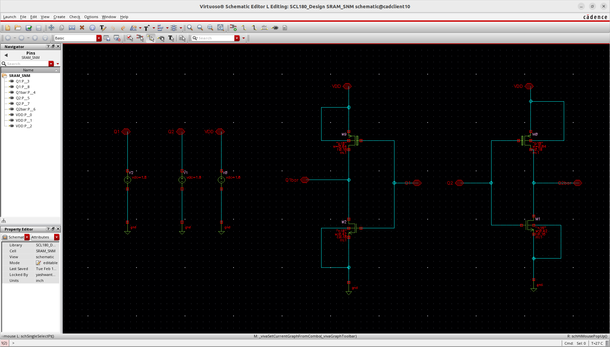

# SRAM 

## SPECIFICATION 

|       TYPE       |     VALUE     |
| ---------------- | ------------- |
|     Word Size    |    32 Bits    |
| Number of Words  |     1024      |
|   Address line   |      10       |
| Number of Words  |     1024      |
|     SRAM Size    |     4 KB      |

## Memory Design Complier

## Prelayout Simulation

### 6T SRAM Cell

SRAM Cell Circuit Schematic:

SRAM Cell Write Operation Circuit Schematic:

SRAM Write Operation:

SRAM Cell Read Operation Circuit Schematic:

SRAM Read Operation: 

### SRAM Stability Analysis: 

Static Noise Margin: 

Hold SNM:

Read SNM: 

SNMLow  = 0.243V 

SNMHigh = 0.222V

Read SNM = min(SNMLow , SNMHigh ) = 0.222V

N Curve :

SVNM = 572.3mV

SINM = 129.41uA

WTV = 889.9mV

WTI = -58.17uA

### Precharge Circuit 

### Sense Amplifier 

### Tristate Buffer

