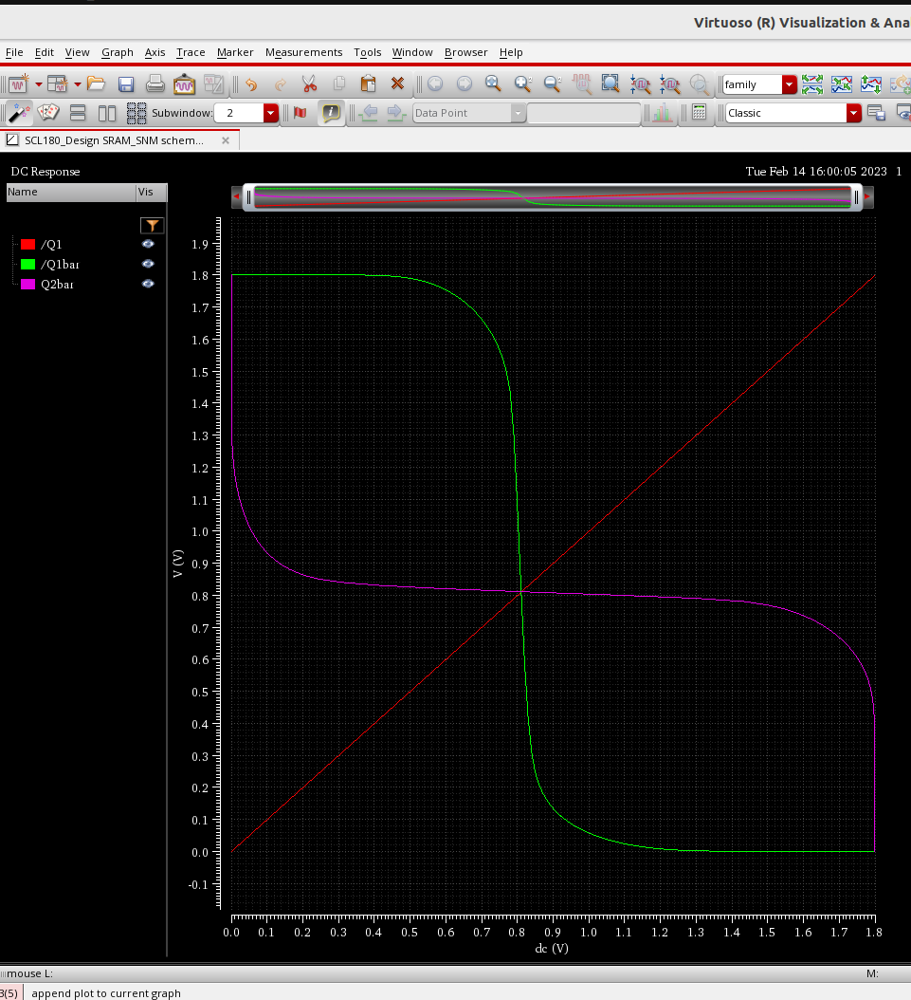

# SRAM 

## SPECIFICATION 

|       TYPE       |     VALUE     |
| ---------------- | ------------- |
|     Word Size    |    32 Bits    |
| Number of Words  |     1024      |
|   Address line   |      10       |
| Number of Words  |     1024      |
|     SRAM Size    |     4 KB      |

## Memory Design Complier

## Prelayout Simulation

### 6T SRAM Cell

A generic SRAM cell is made up of six MOSFETs, and is often called a 6T SRAM cell. Each bit in the cell is stored on four transistors that form two cross-coupled inverters. This storage cell has two stable states which are used to denote 0 and 1. Two additional access transistors serve to control the access to a storage cell during read and write operations. 

#### SRAM Cell Circuit Schematic:
  
This is a achematic of the 6T SRAM cell. Here, the 4 MOSFETs M0, M1, M4, M5 are cross-coupled to form the latch like component to store a bit. This bit can be read or write through the transister M2 and M3 using write line and bit line.

   

#### SRAM Cell Write Operation :

The bit to be written and its inversion are loaded onto the bit line and inverted bit line respectfully. Once the write signal goes HIGH, the access transistor are enabled and the bit value on the bit line is written upon the previously stored bit.

#### SRAM Cell Read Operation :

Unlike write operation, Read operation is a bit tricky in SRAM cell. This is becuase, before enabling the access transistors, the bit-lines are first pre-charged to high logic. Depending upon the bit store, one of the bit-line is pulled back to logic low when the access transistors are enabled. 

### SRAM Stability Analysis: 

The conventional method to measure SRAM stability is static stability analysis, which measures the stability of SRAM by measuring the magnitude of static noise tolerance

Static Noise Margin: 

Static noise margin (SNM) is a key figure of merit for an SRAM cell. It can be extracted by nesting the largest possible square in the two voltage transfer curves     (VTC) of the two CMOS inverters involved. The SNM is defined as the side-length of the square (i.e. diagonal-length), given in volts. When an external DC noise is     larger than the SNM, the state of the SRAM cell can change and data is lost.

 1. Hold SNM:

   Hold Static Noise Margin (HSNM) determines the stability of an SRAM cell in the standby mode. The HSNM is determined by the length of a side of the largest square      that can be inscribed inside the smaller of two lobes

2. Read SNM: 

  Read Static Noise Margin (SNM) is a measure of the stability of an SRAM cell during a read operation. The read margin is directly proportional to the cell ratio       and increases with the increase in value of the pull-up ratio

SNMLow  = 0.243V 

SNMHigh = 0.222V

Read SNM = min(SNMLow , SNMHigh ) = 0.222V

3. N Curve :

   N-curve is a metric used for inline testers. It gives information for both voltage and current, and in addition it has no voltage scaling delimiter as found in SNM    approach. It also has the complete information about the SRAM stability and also write ability in a single plot. N-curve can be further extended to power metrics      in  which both the voltage and current information are taken into consideration to provide better stability analysis of the SRAM cell.

  * Static Voltage Noise Margin (SVNM): 

    It is the voltage difference between point A and B. It indicates the maximum tolerable DC noise voltage of the cell before its content changes.
  
    SVNM = 572.3mV

  * Static Current Noise Margin (SINM):

    It is the additional current information provided by the N-curve, namely the peak current located between point A and B. It can also be used to characterize the       cell read stability.

    SINM = 129.41uA

Note: For better read stability, SVNM and SINM must be high value.

  * Write-Trip Voltage (WTV): 

    It is the voltage difference between point C and B. It is the voltage drop needed to flip the internal node “1” of the cell with both the bit-lines clamped to VDD.
  
    WTV = 889.9mV

  * Write-Trip Current (WTI): 
  
    It is the negative current peak between point C and B. It is the amount of current needed to write the cell when both bit-lines are kept at VDD.
  
    WTI = -58.17uA
  

### Precharge Circuit 

A pre-charge circuit for SRAM is a circuit that reduces the active current consumption and bit line peak current by decreasing the number of bit lines to be pre-charged at any one time during a pre-charge cycle

Shown below is the schematic and simulation of a Precharge Circuit.

### Sense Amplifier 

The function of sense amplifier is to amplify the very small analog differential voltage between the bit-lines during a read operation and provide a digital output. This effectively reduces the time required for the read operation, as each individual cell need not fully discharge the bit line.

* if bit > bit_bar, output is 1
* if bit < bit_bar, output is 0

Shown below is the schematic and simulation of a Sense Amplifier.

### Tristate Buffer

Tri-state buffer is a normal buffer with an extra enable input. Whenever, the enable input is high, tri-state buffer behaves as a normal buffer, otherwise it will either give high impedance or low logic as output.

Shown below is the schematic and simulation of a Tri-State Buffer.

